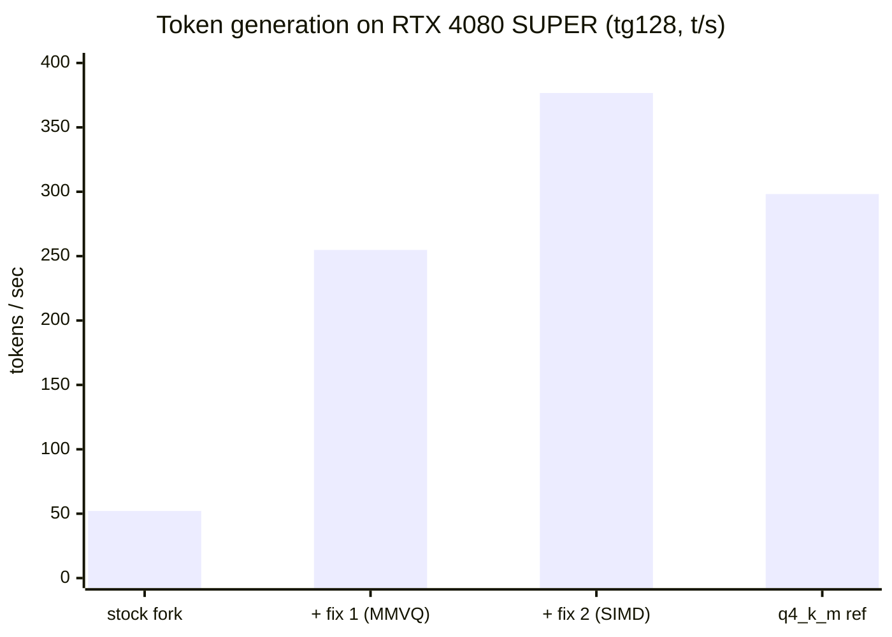
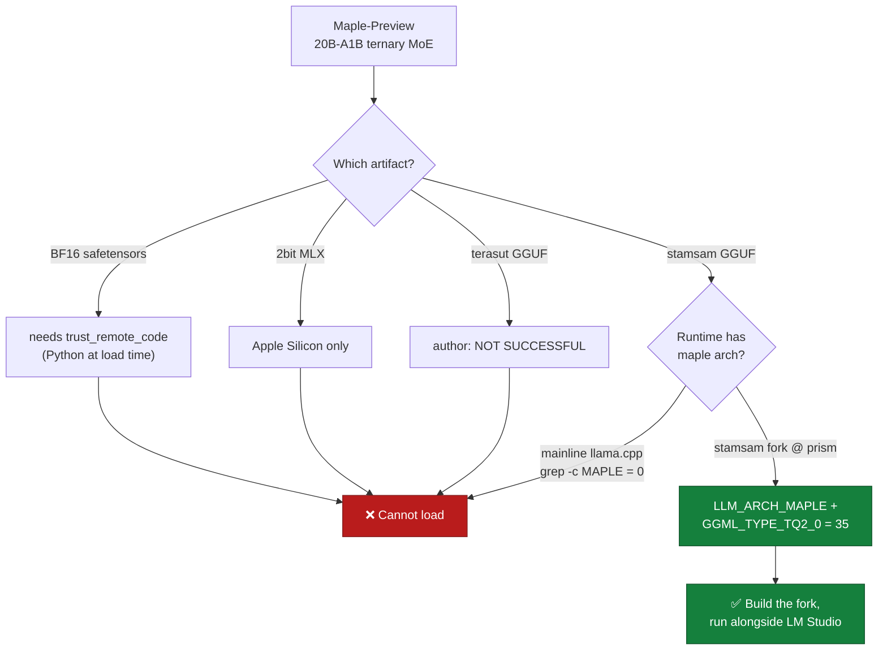
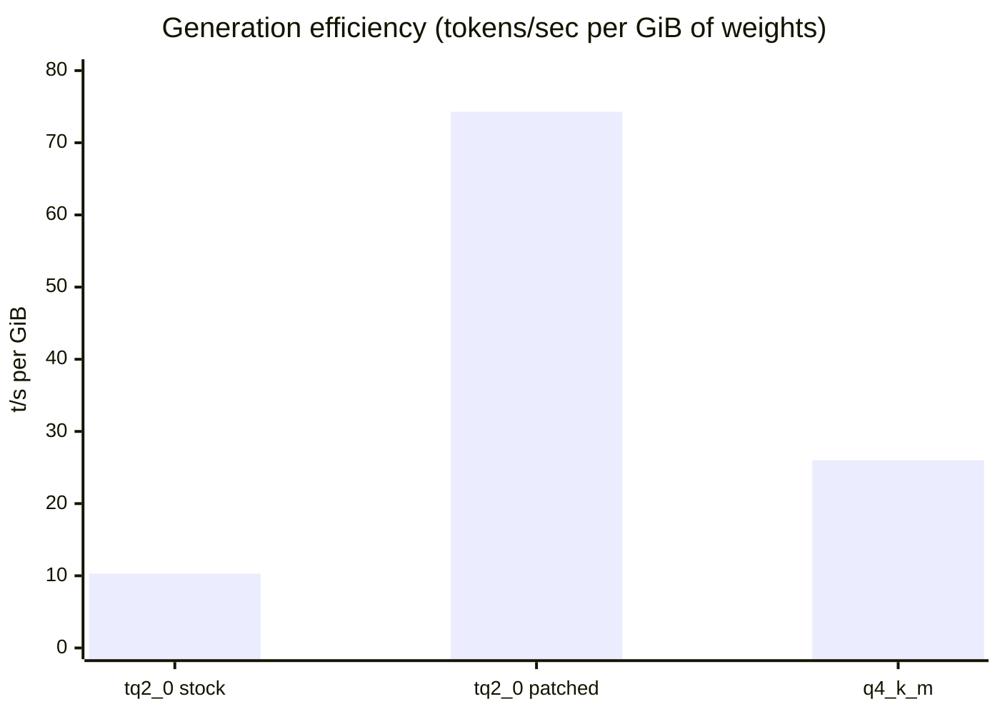
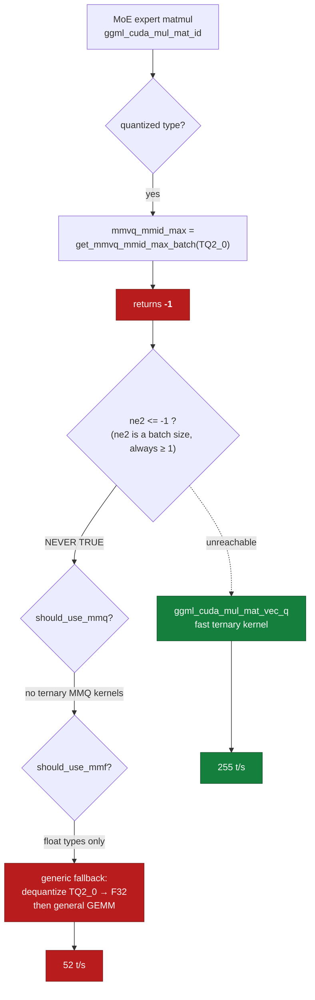
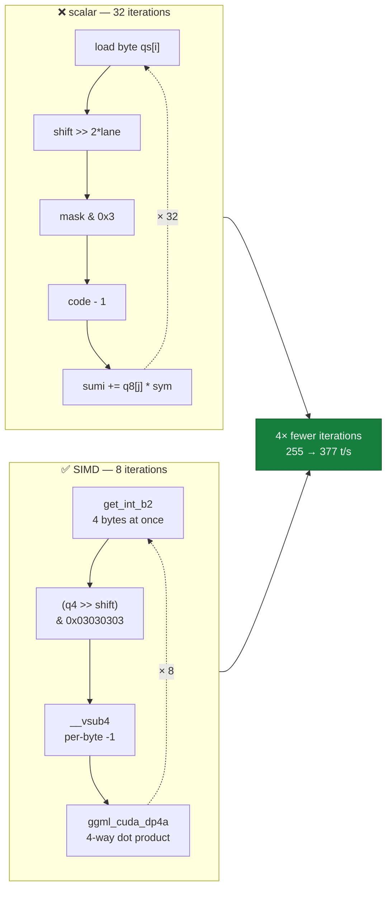
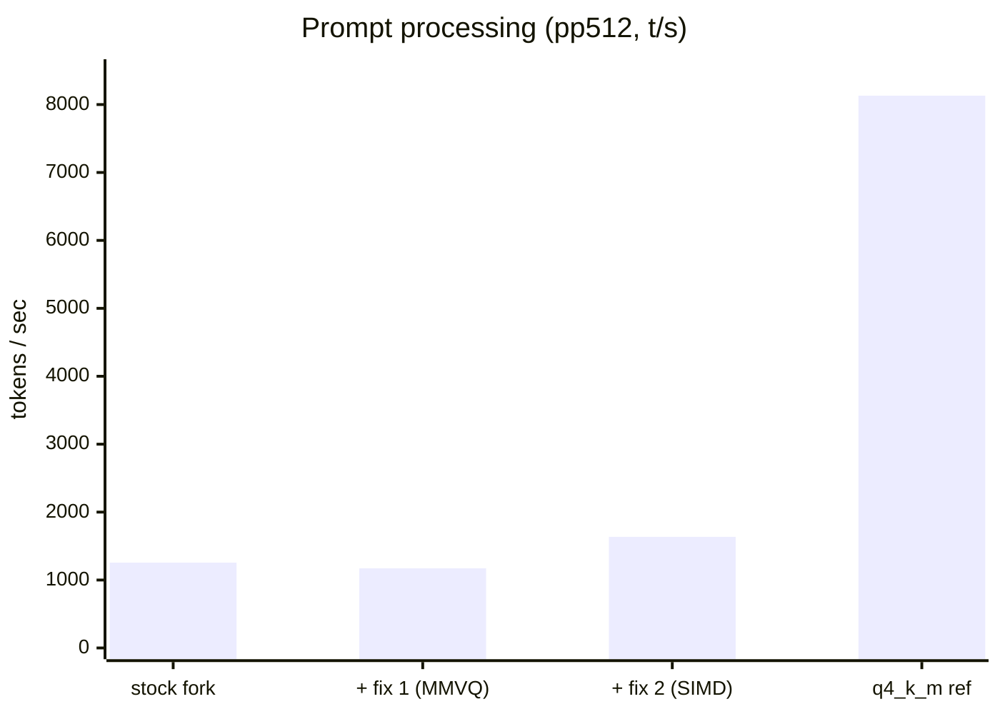
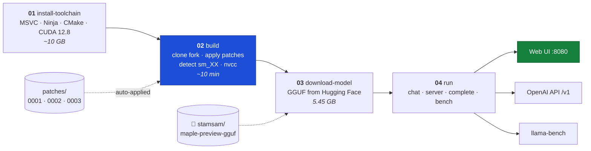
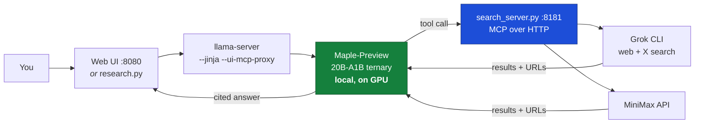
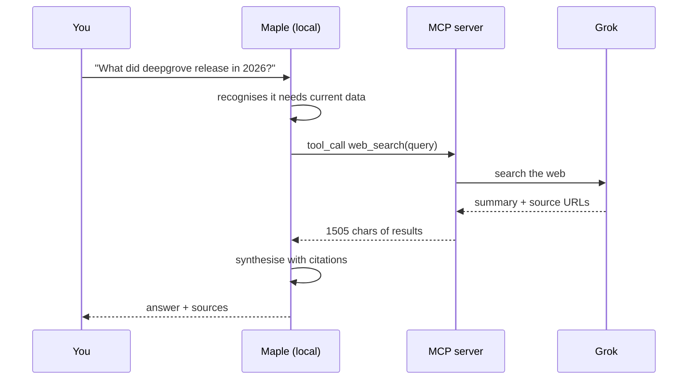
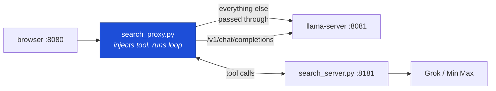

# Running Maple-Preview locally on Windows + CUDA

Four scripts that take a stock Windows machine to a running
[Maple-Preview](https://huggingface.co/deepgrove/maple-preview) — a 20B-A1B
**ternary-weight** MoE reasoning model — served over an OpenAI-compatible API on
consumer hardware.

No weights are committed here. Everything is pulled from Hugging Face at setup
time.

---



> Two kernel fixes took ternary generation from **52 → 377 t/s (7.2×)**, past the
> `q4_k_m` reference at 298 t/s — in **44% of the memory**.

## Why this repo exists

The original goal was mundane: *install Maple-Preview in LM Studio*. It turns
out that is impossible, and the interesting part is **why**.



Maple's weights are ternary — every value is `{-1, 0, +1}` with a per-row scale,
which is how 20B parameters compress into 5.45 GB. That format is
`GGML_TYPE_TQ2_0` (type 35), and the architecture is a 3:1 hybrid of
sliding-window and global attention where the **global layers carry no
positional encoding at all**. Neither the type nor the architecture exists in
mainline llama.cpp:

```console
$ curl -sL .../llama.cpp/master/src/llama-arch.cpp | grep -ic "MAPLE"
0
```

LM Studio ships a mainline-derived llama.cpp (`…cuda12-avx2@2.27.1`, GGUF only),
so it rejects these files with `unknown model architecture: 'maple'`. There is
no setting that fixes this, and no plugin interface to extend it.

**[→ Full diagnostic writeup with the complete evidence trail](docs/why-lm-studio-cannot-run-maple.md)**

The path that *does* work is building the fork that implements the architecture,
and running it alongside LM Studio rather than inside it.

---

## Quickstart

```powershell
git clone https://github.com/PascalAI2024/maple-preview-windows-cuda.git
cd maple-preview-windows-cuda

./scripts/01-install-toolchain.ps1   # MSVC + Ninja + CMake + CUDA 12.8  (~10 GB)
./scripts/02-build.ps1               # clone + build the Maple fork
./scripts/03-download-model.ps1      # pull maple-tq2_0.gguf from HF     (5.45 GB)
./scripts/04-run.ps1 -Mode complete  # verify it generates
```

Then serve it:

```powershell
./scripts/04-run.ps1 -Mode server    # web UI + OpenAI-compatible API on :8080
```

### Actually using it

**Open <http://127.0.0.1:8080> in a browser.** `llama-server` ships a full chat
web UI — conversations, settings, reasoning-trace toggle, file attachments, even
MCP server support. This is the direct LM Studio replacement, and it is the
simplest way to use the model day to day.

Measured in that UI on the 4080 SUPER: **287.4 t/s** generating a 220-token reply
(higher than the `llama-bench` figure, which carries more measurement overhead).

Because the same port also speaks the OpenAI API, any compatible client works —
Open WebUI, Cherry Studio, VS Code extensions, or your own code:

```python
from openai import OpenAI
client = OpenAI(base_url="http://127.0.0.1:8080/v1", api_key="not-needed")
print(client.chat.completions.create(
    model="maple", messages=[{"role": "user", "content": "Hello"}]
).choices[0].message.content)
```

Prefer the terminal? `./scripts/04-run.ps1 -Mode chat`.

```console
$ curl -s http://127.0.0.1:8080/v1/chat/completions \
    -H "Content-Type: application/json" \
    -d '{"messages":[{"role":"user","content":"Name the capital of Japan in exactly one word."}]}'

{"choices":[{"message":{"content":"Tokyo"}}],
 "model":"maple-tq2_0.gguf",
 "usage":{"prompt_tokens":20,"completion_tokens":32,"total_tokens":52}}
```

### Requirements

- Windows 10/11, NVIDIA GPU (compute capability detected automatically)
- ~8 GB VRAM for the `tq2_0` pack at 8K context (measured, see below)
- ~20 GB disk for toolchain + fork + build, plus the model

---

## Measured results

Everything below was measured on this setup, not estimated or copied.

**RTX 4080 SUPER (16 GB) · CUDA 12.8 · MSVC 14.44 · sm_89 · fork rev `9ee03ee`**

| Metric | Value |
|---|---|
| Prompt processing (pp512) | **1636 t/s** |
| Token generation (tg128) | **376.7 t/s** |
| VRAM, 8K ctx, 4 server slots | **7.3 GB** of 16 GB |
| Model load → first token | ~3 s |
| Build time (434 targets, one arch) | ~10 min |

A 20B-parameter model generating at **~377 t/s in 7.3 GB of VRAM** is the whole
point of ternary weights.

### Two CUDA fixes, 7.2× faster generation

Out of the box this ran at **52 t/s**. Two changes to the ternary kernels took it
to **377 t/s**:

| Build | pp512 | tg128 | vs stock |
|---|---:|---:|---:|
| stock fork | 1255.7 | 52.1 | — |
| `+ 0001` enable MMVQ for batch-1 MoE | 1173.4 | 254.8 | 4.9× |
| `+ 0002` SIMD ternary vec_dot | **1635.8** | **376.7** | **7.2×** |
| `q4_k_m` reference (mature kernels) | 8130.5 | 298.2 | — |

Note the patched ternary build now **generates faster than Q4_K** (377 vs 298
t/s) in **44% of the memory** — while still trailing badly on prompt processing,
which is the missing MMQ kernels.



Per gigabyte of weights, the patched ternary build does **2.9× more work** than
Q4_K. That ratio is the entire argument for ternary quantization, and before
these fixes the CUDA path was throwing it away.

Both changes are validated against the CPU reference by `test-backend-ops`:
**103/103 tests pass** (72 MUL_MAT_ID + 31 MUL_MAT).

### Fix 1 — the unreachable fast path

Out of the box this ran at **52 t/s**, which was suspicious: Maple activates only
~1B of its 20B parameters per token, and a dense 1B model on this card runs many
hundreds of t/s.

The cause was a single line in `ggml/src/ggml-cuda/mmvq.cu`. `get_mmvq_mmid_max_batch`
returned `-1` for the ternary type, and the call site tests `ne2 <= mmvq_mmid_max`
— which, since `ne2` is a batch size ≥ 1, is **never true**. The ternary MMVQ
kernel existed and was wired for MoE expert routing, but was unreachable at every
batch size, so every expert matmul fell through to dequantize-to-F32 + GEMM.



The dotted edge is the path that *should* have been taken. Returning `1` instead
of `-1` admits batch-1 generation to the fast kernel while leaving large batches
on the old path. **52 → 255 t/s.**

### Fix 2 — a scalar loop where SIMD belonged

With the fast path finally reachable, the kernel it reached turned out to be
unvectorized. `vec_dot_tq2_0_q8_1` looped 32 times, once per element:

```c
for (int j = 0; j < 32; ++j) {
    const int code = (bq->qs[byte_base + j] >> (2 * lane)) & 0x3;
    sumi += bq8_1_chunk->qs[j] * (code - 1);
}
```

Comparable types use packed integer SIMD. Ternary can too — 4 elements per step:

```c
const int q4    = get_int_b2(bq->qs, (byte_base + j) / 4);  // 2-byte-aligned read
const int codes = (q4 >> shift) & 0x03030303;               // 4 codes at once
const int syms  = __vsub4(codes, 0x01010101);               // {0,1,2} -> {-1,0,+1}
sumi = ggml_cuda_dp4a(syms, get_int_b4(bq8_1_chunk->qs, j / 4), sumi);
```

Two details make it work: `__vsub4` does a *per-byte* subtract, because a plain
integer subtract would let code `0` borrow into the neighbouring byte; and
`get_int_b2` is the aligned-safe read, since `block_tq2_0` is 66 bytes and so
blocks land on 2-byte, not 4-byte, boundaries. **255 → 377 t/s.**



Both fixes together, measured across all three metrics:



Prompt processing is where ternary still loses badly — that 5× gap to `q4_k_m` is
the missing MMQ kernels, and it is the honest remaining work.

Patches are applied automatically by `02-build.ps1`; use `-NoPatch` for stock.

**[→ Full investigation, evidence, and correctness checks](docs/moe-ternary-perf-fix.md)**

**On the 218 tok/s claim:** the model card's headline figure is measured on an
**M4 Mac mini using deepgrove's own on-device runtime** — a different stack
entirely from CUDA + llama.cpp, so it was never a like-for-like comparison with
the numbers here.

**I am not upstreaming this.** llama.cpp's `AGENTS.md` does not accept
predominantly AI-generated PRs and instructs autonomous agents not to contribute;
it exempts private forks, which is what this is.

---

## What each script does



Nothing heavy is committed here: the fork, the build and the weights are all
fetched by the scripts.

| Script | Does | Notes |
|---|---|---|
| `01-install-toolchain.ps1` | winget-installs MSVC, Ninja, CMake, CUDA | Chained, not parallel — concurrent MSI installs fight over the Windows Installer mutex |
| `02-build.ps1` | Clones `stamsam/llama.cpp@prism`, builds with CUDA | Detects compute capability from `nvidia-smi`; asserts `LLM_ARCH_MAPLE` is present before spending 30 min on nvcc |
| `03-download-model.ps1` | Fetches a GGUF from Hugging Face | Resumable; verifies byte count and GGUF magic |
| `04-run.ps1` | Runs `chat`, `server`, `complete`, or `bench` | `-NGL 99` offloads every layer; adds CUDA to PATH so the loader finds `cudart`/`cublas` |

`04-run.ps1 -Mode <mode>`:

| Mode | Binary | Use |
|---|---|---|
| `chat` | `llama-cli` | Interactive terminal session |
| `server` | `llama-server` | OpenAI-compatible API on :8080 |
| `complete` | `llama-completion` | One-shot prompt, prints and exits |
| `bench` | `llama-bench` | Throughput measurement |

This fork's `llama-cli` dropped `--no-conversation` (*"please use
llama-completion instead"*), which is why one-shot generation is a separate
binary rather than a flag.

### Model variants

`03-download-model.ps1 -Variant <name>` — sizes measured, not estimated:

| Variant | Size | Notes |
|---|---|---|
| `tq2_0` | 5.45 GB | Ternary, the fork's native format — **default** |
| `q4_k_m` | 12.33 GB | Uniform Q4_K_M |
| `f16` | 40.5 GB | Dense reference; needs heavy offload on consumer cards |

---

## The model

| Property | Value |
|---|---|
| Params | 20.2 B total, ~1 B active (A1B) |
| Layers | 24 |
| MoE | 256 experts, top-8, `moe_intermediate` 512, clamp-7 SwiGLU |
| Attention | 3:1 hybrid — SWA-512 : Global Attention |
| RoPE | Partial (64/128, theta 10000) on SWA layers; **none** on GA layers |
| Context | 131,072 |
| Licence | MIT |

---

## Giving it web search (research mode)

A local model knows nothing after its training cut-off. `mcp/search_server.py` is
a small MCP server exposing a `web_search` tool, backed by Grok (web + native
X/Twitter search) or MiniMax. Maple is tool-capable — its chat template has a
`<tools>` block — so it can drive it.



The reasoning stays local on your GPU; only the search query leaves the machine.



```powershell
./scripts/05-research-stack.ps1
```

That is the whole setup. Open <http://127.0.0.1:8080> and ask something current —
search is already wired in, with nothing to configure in the browser.

**Why a proxy rather than the UI's MCP panel.** llama-server keeps MCP server
config in the browser's **IndexedDB**, reachable only through a modal in the web
UI. There is no server-side flag for it, so that setup cannot be scripted,
committed, or reproduced on another machine. `mcp/search_proxy.py` sits in front
of llama-server, passes everything through untouched, and injects the
`web_search` tool into `/v1/chat/completions` — running the tool loop
server-side. The browser sees an ordinary chat endpoint; the model gets search.



There is also a CLI path that needs no proxy:

```powershell
python mcp/research.py "What did deepgrove release in 2026 and how fast is it?"
```

Real output from that command:

```
tools available: ['web_search']
[round 1] web_search({'query': 'deepgrove Maple-Preview token generation speed Apple hardware'}) ...
    -> 1505 chars returned

--- answer (after 1 search round(s)) ---
On Apple hardware, the token generation speeds claimed are:
- ~218 tokens/s on a Mac mini M4 ... - ~120 tokens/s on iPhone
These speeds are achieved on-device using a separate runtime (not the CUDA path).
Sources: https://huggingface.co/deepgrove/maple-preview ...
```

**One thing the proxy has to work around.** Maple does not always emit a
structured `tool_calls` field — sometimes it writes the Hermes-style
`<tool_call>{...}</tool_call>` block as plain text, and when it does so inside the
reasoning channel, llama-server's parser does not lift it out. The request then
comes back with no tool call *and* no answer, so the user sees a blank reply. The
proxy salvages those blocks out of the text and executes them anyway, which is
what turns tool use from intermittent into reliable. It also forces a final
answer if the model is still searching when it runs out of rounds, for the same
reason: otherwise the last message is a tool call with empty content.

**On cost:** the Grok CLI prints a `total_cost_usd` per call (~$0.09 in testing),
but that is an API-equivalent figure it reports regardless of how the account is
billed. If the CLI is signed in via OAuth (`auth_mode: oidc` in
`~/.grok/auth.json`, i.e. a subscription seat), searches draw against plan
quota and rate limits rather than incurring that charge. Only an API-key setup
bills per call. MiniMax uses `MINIMAX_API_KEY` and *is* metered per request.

Neither port should be exposed beyond localhost; llama.cpp documents
`--ui-mcp-proxy` as unsafe in untrusted environments.

## Testing kernel changes

Ternary is **excluded from llama.cpp's test suite** — commented out with
`// TODO: implement for all backends` — so `tq2_0` kernels ship with no automated
coverage at all. That is how a bug like Fix 1 survives.

`patches/0003` enables it. To validate a kernel change against the CPU reference:

```powershell
./scripts/02-build.ps1 -WithTests
./fork/build/bin/test-backend-ops.exe test -o MUL_MAT_ID -p tq2_0
./fork/build/bin/test-backend-ops.exe test -o MUL_MAT    -p tq2_0
```

Use `-BuildDir` to compile a variant into a separate directory, so you can
benchmark it while a server keeps running out of the default build.

## Things that bit me

Recorded because each cost real time and the failure modes are unhelpful.

| Symptom | Cause | Fix |
|---|---|---|
| Build exits 255 immediately, no diagnostic | A generated `.bat` used `^` line continuations, and PowerShell wrote it with LF endings. `cmd` mis-parses continuations on LF and stops **silently** | Don't generate batch wrappers. Import the MSVC env into PowerShell and call `cmake` directly with an argument array |
| `Join-Path : Cannot bind argument … empty string` | `$PSScriptRoot` is not reliably populated inside a `param()` default block | Default to `''`, resolve in the script body |
| `nvcc is not recognized` right after a successful CUDA install | `%CUDA_PATH%` is only set for shells started *after* the installer runs | Glob `…/NVIDIA GPU Computing Toolkit/CUDA/v*` for the newest dir containing `nvcc.exe` |
| Exit `-1073741515`, no message | `0xC0000135` = `STATUS_DLL_NOT_FOUND`. `cudart64_*.dll`/`cublas64_*.dll` are not copied next to the exe | Prepend the toolkit's `bin` to `PATH` at run time |
| `llama-cli` ignores the prompt, loops on `>` forever | This fork removed `--no-conversation` | Use the `llama-completion` binary |
| `ReadAllBytes … file is too long` | .NET Framework caps `ReadAllBytes` at 2 GB; these files are 5–40 GB | Read the 4 magic bytes via a `FileStream` |

## Caveats

Read these before drawing conclusions from anything this repo produces.

- **This is day-zero code.** Both Maple-Preview and the runtime fork were
  published 2026-08-05. The fork's own status note: *"no benchmarks, perplexity,
  or systematic evals yet."*
- **The fork is a research port, not a distribution.** It publishes no releases,
  which is why these scripts build from source.
- **`tq2_0` GPU support is new.** Its CUDA kernels landed at rev `9ee03ee`.
  Large-batch matmuls still fall back to dequant+GEMM because the ternary `mmq`
  kernels are not written yet — measured at ~7× slower prompt processing than
  `q4_k_m` on the identical model. That is the main remaining gap.
- **The performance patch is mine, not upstream's**, and is verified on exactly
  one GPU (sm_89). See [the writeup](docs/moe-ternary-perf-fix.md) for what was
  and was not checked; `-NoPatch` builds the fork stock.
- **LM Studio is untouched.** Nothing here modifies your existing install; the
  fork runs as a separate server.
- **If mainline llama.cpp ever merges `maple` + `tq2_0`, this repo is
  obsolete** and LM Studio would support the model directly. That is the good
  outcome.

---

## Credits

This repo is glue and documentation. The hard work belongs to others:

- **[deepgrove/maple-preview](https://huggingface.co/deepgrove/maple-preview)** — the model (MIT)
- **[stamsam/llama.cpp](https://github.com/stamsam/llama.cpp)** (branch `prism`) — the Maple architecture, ternary `tq2_0` type, and CUDA kernels that make any of this possible (MIT)
- **[stamsam/maple-preview-gguf](https://huggingface.co/stamsam/maple-preview-gguf)** — the GGUF conversions (MIT)
- **[ggml-org/llama.cpp](https://github.com/ggml-org/llama.cpp)** — upstream (MIT)

Licensed MIT. See [LICENSE](LICENSE).
