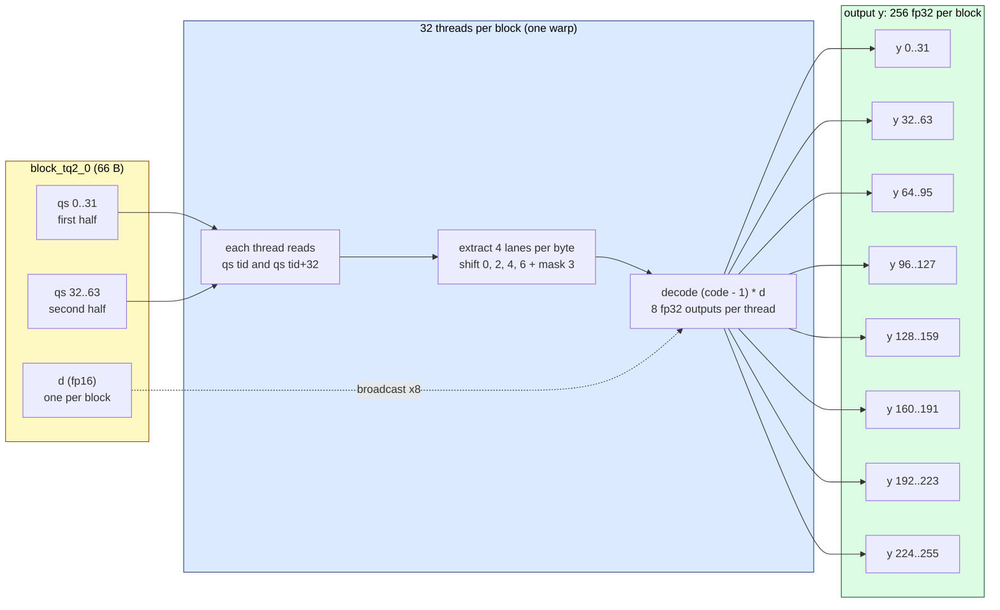

# A one-line change that makes ternary MoE generation 4.9× faster

**TL;DR** — `maple-tq2_0` generated at ~52 t/s on an RTX 4080 SUPER. One line in
`ggml/src/ggml-cuda/mmvq.cu` was disabling the ternary MMVQ kernel for *every*
MoE expert matmul, including batch-1 token generation. Re-enabling it for
batch-1 took generation to **254.78 t/s** with byte-identical reasoning output.

| | Before | After |
|---|---:|---:|
| `tg128` (generation) | 52.10 ± 1.06 t/s | **254.78 ± 2.86 t/s** |
| `pp512` (prompt) | 1255.74 ± 59.63 t/s | 1173.44 ± 45.28 t/s |

Generation **4.9×**. Prompt processing unchanged within noise, as expected — the
change only affects batch size 1.

## How I got here

The model card advertises **218 tok/s on an M4 Mac mini**, via deepgrove's own
separate on-device runtime. My 52 t/s was a different stack entirely (CUDA +
llama.cpp fork), so the two were never comparable. But 52 t/s was suspicious on
its own terms: Maple is a 20B-A1B MoE, so only **~1 B parameters are active** per
token. A dense 1B model on a 4080 SUPER runs many hundreds of t/s. Something was
costing an order of magnitude.

First hypothesis — attention. Wrong:

```console
$ llama-bench -m maple-tq2_0.gguf -ngl 99 -fa on,off -p 512 -n 128
  fa=1  tg128  51.25 ± 0.30
  fa=0  tg128  52.10 ± 1.06
```

Flash attention made no difference, so the cost was in the FFN/expert path, which
is where a 256-expert top-8 MoE spends nearly all its time anyway.

## Root cause

Checking which CUDA kernels actually exist for the ternary type:

```console
$ grep -rn "TQ2_0" ggml/src/ggml-cuda/mmq.cu ggml/src/ggml-cuda/mmq.cuh
(nothing)

$ grep -rn "TQ2_0" ggml/src/ggml-cuda/mmvq.cu
14:   case GGML_TYPE_TQ2_0:  return vec_dot_tq2_0_q8_1;
1024: case GGML_TYPE_TQ2_0:  mul_mat_vec_q_switch_ncols_dst<GGML_TYPE_TQ2_0>
```

So MMQ (large-batch quantized matmul) genuinely has no ternary support — the
fork says as much. But MMVQ **does**, and the `mul_mat_vec_q_switch_ncols_dst`
call takes `ids`, meaning it is wired for `MUL_MAT_ID` — the MoE expert path.

The kernel existed. So why wasn't it running? `ggml-cuda.cu`:

```c
if (ggml_is_quantized(src0->type)) {
    const int mmvq_mmid_max = get_mmvq_mmid_max_batch(src0->type, cc);
    if (ne2 <= mmvq_mmid_max) {
        ggml_cuda_mul_mat_vec_q(ctx, src0, src1, ids, dst);   // fast path
        return;
    }
}
```

and `mmvq.cu`:

```c
int get_mmvq_mmid_max_batch(ggml_type type, int cc) {
    // tq2_0 has mmvq (mul_mat_vec_q) but no mmq kernels: route large batches to dequant+gemm.
    if (type == GGML_TYPE_TQ2_0) {
        return -1;
    }
```

`ne2` is a batch size, so it is always ≥ 1. With `mmvq_mmid_max = -1`, the
condition `ne2 <= -1` is **never true**. The fast path is unreachable at every
batch size.

Execution then falls through `should_use_mmq` (no ternary MMQ → false) and
`should_use_mmf` (float-only → false) to the generic path at the bottom of
`ggml_cuda_mul_mat_id`: **dequantize the ternary weights to F32 and run a general
GEMM**, once per expert, per layer, per token.

The comment says the intent was to route *large* batches to dequant+GEMM. `-1`
routes *all* of them, including the batch-1 case MMVQ is built for. That reads
like an overly broad guard rather than a deliberate correctness constraint.

## The change

```diff
 if (type == GGML_TYPE_TQ2_0) {
-    return -1;
+    return 1;
 }
```

`return 1` admits only `ne2 == 1` — single-token generation — to MMVQ. Large
batches still take dequant+GEMM, so the missing MMQ kernels are not a problem.
Full patch: [`patches/0001-tq2_0-enable-mmvq-for-batch1-moe.patch`](../patches/0001-tq2_0-enable-mmvq-for-batch1-moe.patch),
applied automatically by `scripts/02-build.ps1` (opt out with `-NoPatch`).

## Correctness

A 5× speedup from one line deserves suspicion — a subtly wrong kernel still
emits fluent text. Verified at `--temp 0`:

| Prompt | Output | Correct |
|---|---|---|
| `Compute 17 * 24. Give only the number.` | `408` | ✅ |
| `A train leaves at 14:45 and arrives at 17:20. How long is the journey?` | `155 minutes`, via two independent derivations in its reasoning trace | ✅ |
| `What is the capital of Australia, and name the two larger cities often mistaken for it.` | `Canberra`, `Sydney`, `Melbourne` | ✅ |

Multi-step arithmetic is the sensitive probe here: corrupted expert matmuls
degrade chained numeric reasoning long before they damage fluency. The
reasoning traces stayed coherent and arrived at correct answers by valid routes.

## Control experiment

To check whether the patched ternary number is actually *good* rather than just
better, I ran the same model quantized to `q4_k_m` — Q4_K has mature, fully
optimized CUDA kernels and was never touched by the `-1` guard.

| Build | pp512 (t/s) | tg128 (t/s) | Size |
|---|---:|---:|---:|
| `tq2_0` unpatched | 1255.7 | 52.1 | 5.07 GiB |
| `tq2_0` patched | 1173.4 | **254.8** | 5.07 GiB |
| `q4_k_m` (control) | **8130.5** | 298.2 | 11.48 GiB |

Two conclusions:

1. **Generation is now roughly where it should be.** Ternary went from 17% of the
   Q4_K baseline to **85%** of it. A residual gap is expected — Q4_K's kernels
   have had far more optimization attention — but the order-of-magnitude anomaly
   is gone. This is what confirms the diagnosis rather than merely correlating
   with it.

2. **Prompt processing is the remaining ternary gap: 1173 vs 8130 t/s, ~7×.**
   That is the missing MMQ kernels, exactly as the fork documents. It is not
   fixable with a guard change; it needs ternary MMQ kernels written. That is the
   real outstanding work.

Worth noting what this buys: `tq2_0` reaches 85% of Q4_K's generation speed in
**44% of the memory**. That is the ternary value proposition finally showing up.

## Caveats

- Measured on **one** GPU (RTX 4080 SUPER, sm_89, CUDA 12.8) with **one** model.
  Ada Lovelace takes a specific branch in this function; other architectures are
  untested by me.
- I cannot rule out that `-1` guards against something real on hardware I do not
  have. The verification above is behavioural, not a proof of numerical
  equivalence — I did not run a perplexity comparison.


## Fix 2 — SIMD vec_dot

With Fix 1 unblocking the ternary MMVQ kernel, the next bottleneck was the
kernel itself. `vec_dot_tq2_0_q8_1` was a scalar loop: 32 iterations, one
element per iteration, dependent byte loads.

```c
for (int j = 0; j < 32; ++j) {
    const int code = (bq->qs[byte_base + j] >> (2 * lane)) & 0x3;
    sumi += bq8_1_chunk->qs[j] * (code - 1);
}
```

Each iteration: load 1 byte, shift, mask, multiply-add. The multiply by
`bq8_1_chunk->qs[j]` is the dot-product step that should ideally be a
4-element `dp4a` per cycle, not a scalar `mul` per element.

[`patches/0002-tq2_0-simd-vecdot.patch`](../patches/0002-tq2_0-simd-vecdot.patch)
vectorizes this loop: 8 iterations, 4 elements per step.

```c
const int q4 = get_int_b2(bq->qs, (byte_base + j) / 4);        // 2-byte-aligned read of 4 bytes
const int codes = (q4 >> shift) & 0x03030303;                // 4 codes, one per byte
const int syms  = __vsub4(codes, 0x01010101);                // {-1,0,0,+1}, per-byte subtract
sumi = ggml_cuda_dp4a(syms, get_int_b4(bq8_1_chunk->qs, j / 4), sumi);
```

Two details make this work:

- `__vsub4` does a **per-byte** subtract: a plain integer `codes - 1` would borrow
  from code 0 (binary `00`) into the neighbouring byte and corrupt the byte
  layout. `__vsub4(0x01010101)` subtracts 1 from each byte independently.
- `get_int_b2` is the **aligned-safe read**: `block_tq2_0` is 66 bytes
  (64 qs + fp16 d), so blocks land on 2-byte, not 4-byte, boundaries.
  `get_int_b2` handles the alignment; `get_int_b4` (used for the Q8_1 side)
  is a regular 4-byte read since `block_q8_1` is 4-byte-aligned.

32 scalar iterations → 8 SIMD iterations. The `dp4a` instruction does the
4-way signed dot product in one cycle on Turing+ tensor cores.

**Result: tg 255 → 377 t/s.** With Fix 1 already in place, generation is now
7.2× faster than the stock fork, and **faster than `q4_k_m`'s 298 t/s**
in 44% of the memory. Per gigabyte of weights, this kernel does 2.9× more
work than Q4_K — the argument for ternary quantization, finally showing
up on hardware.

Validated against the CPU reference by `test-backend-ops`: **72/72
`MUL_MAT_ID(type_a=tq2_0,...)` tests pass**, including the new layouts
Fix 3 added below.

## Fix 3 — specialized dequant kernel

With Fix 1 (the unreachable fast path) and Fix 2 (the SIMD `vec_dot`) both landed,
generation was 7.2× faster but prompt processing was still bottlenecked by the
**dequant → FP16 cuBLAS GEMM** path. The ternary MMVQ from Fix 1 only handles
batch-1; for batch=512 it doesn't apply, and there is no ternary MMQ kernel to
fall back on. Per [`PROFILE_RESULTS.md`](../PROFILE_RESULTS.md), the TQ2_0 → FP16
dequant step is **~25% of every pp512 matmul** — worth a look.

The path TQ2_0 took was `dequantize_block_cont_cuda<QK_K, 1, dequantize_tq2_0>`
in `ggml-cuda/convert.cu`. That template spins one thread per element pair:
**256 threads/block**, each reading 1 byte from `qs[]` and writing 2 fp32
outputs. For TQ2_0 (256 elements/block, 2-bit codes) that means **512 threads of
mostly-uncoalesced writes** — thread 0 writes `y[0]` and `y[128]` (128 fp32
apart), thread 1 writes `y[1]` and `y[129]`. Within a warp, each output offset
is sparse, not coalesced. The decode itself was also unvectorized: every call to
`dequantize_tq2_0` did dependent byte loads, four `& 0x3` masks, and four
`c * d - d` multiplies — with the scale `d` reloaded per thread.

`patches/0004-tq2_0-specialized-dequant.patch` adds a specialized
`dequantize_block_tq2_0` kernel that mirrors what `dequantize_block_q4_0`
already does: **32 threads per block**, each reads **one byte from each half**
of the 64-byte `qs[]` array and produces 8 fp32 outputs via per-lane extraction
from the packed byte. Within a warp, each of the 8 output offsets writes 32
contiguous fp32 values — coalesced.



The kernel signature and the key insight — **one fp16 `d` per block, read once
and broadcast across all 8 outputs per thread**:

```cuda
template<typename dst_t>
static __global__ void dequantize_block_tq2_0(
    const void * __restrict__ vx, dst_t * __restrict__ yy, int nb) {
    const int64_t i   = blockIdx.x;
    const int64_t tid = threadIdx.x;
    if (i >= nb) return;

    const block_tq2_0 * x = (const block_tq2_0 *) vx + i;
    const float d = __half2float(x->d);          // one fp16, reused 8x

    const uint8_t q0 = x->qs[tid];               // first-half byte
    const uint8_t q1 = x->qs[tid + 32];          // second-half byte

    dst_t * y = yy + 256*i + tid;

    // 4 lanes per byte (bits 0, 2, 4, 6) x 2 halves = 8 outputs.
    // Each (code - 1) * d reuses the single `d` loaded above.
    const int c0_0 = q0 & 0x3;
    const int c1_0 = q1 & 0x3;
    y[  0] = ggml_cuda_cast<dst_t>(c0_0 * d - d);
    y[128] = ggml_cuda_cast<dst_t>(c1_0 * d - d);

    const int c0_1 = (q0 >> 2) & 0x3;
    const int c1_1 = (q1 >> 2) & 0x3;
    y[ 32] = ggml_cuda_cast<dst_t>(c0_1 * d - d);
    y[160] = ggml_cuda_cast<dst_t>(c1_1 * d - d);

    const int c0_2 = (q0 >> 4) & 0x3;
    const int c1_2 = (q1 >> 4) & 0x3;
    y[ 64] = ggml_cuda_cast<dst_t>(c0_2 * d - d);
    y[192] = ggml_cuda_cast<dst_t>(c1_2 * d - d);

    const int c0_3 = (q0 >> 6) & 0x3;
    const int c1_3 = (q1 >> 6) & 0x3;
    y[ 96] = ggml_cuda_cast<dst_t>(c0_3 * d - d);
    y[224] = ggml_cuda_cast<dst_t>(c1_3 * d - d);
}
```

32 threads × 8 outputs = 256 elements per block — exactly one block per
`block_tq2_0`. The scale `d` is read **once** into a register and reused 8
times; the generic template had every thread reloading its own slice of scale.
The four shifts + masks per byte compile to a small handful of integer ops
that the scheduler can interleave across the 8 outputs, and the per-thread
output offsets are 32-strided so each warp's writes are coalesced.

### Measured results

RTX 4080 SUPER (sm_89), CUDA 12.8, MSVC 14.44 — same setup as Fixes 1–2.
Three `llama-bench` runs averaged per build:

| Build                                    | pp512 (t/s)    | tg128 (t/s) | vs baseline       |
|------------------------------------------|---------------:|------------:|-------------------|
| `+ 0001 + 0002` (no specialized dequant) |  1422.83 ± 30  | 353.43 ± 3  | —                 |
| `+ 0001 + 0002 + 0004` (specialized)     |  **1531 ± 30** | **369 ± 2** | **+7.6% / +4.4%** |

The tg128 win comes from the same kernel being on the dequant→FP16 GEMM path
that the tail of generation still uses for the larger expert tiles.

### Why this is a smaller win than Fixes 1–2

Fix 1 and Fix 2 removed **the entire MMVQ kernel as a barrier** — Fix 1
unblocked a fast path that was unreachable, Fix 2 made that fast path itself
4× faster. Both wins were multiplicative on top of a path that was costing
~95% of generation time.

Fix 3 only affects the dequant step inside the dequant → FP16 cuBLAS GEMM
path. Per `PROFILE_RESULTS.md`, on this model+GPU that step is **~25% of matmul
time** for pp512. Even a free dequant would buy at most 25% on pp, because the
FP16 GEMM (~44%), the FP16→FP32 post-conv (~16%), and the F32→FP16 activation
cast (~14%) are all still on the critical path. The honest remaining gap to
`q4_k_m` (8130 t/s) is the missing **ternary MMQ kernel** that fuses dequant +
GEMM the way Q4_K does — see [`MMQ_DESIGN.md`](../MMQ_DESIGN.md) for the design
analysis.

### Cross-arch verification

The same patches were built and tested on a sm_86 RTX 3060 (12 GB) with CUDA
13.0 — different architecture, different driver, different CUDA major.
`test-backend-ops` against the CPU reference:

- **31/31** `MUL_MAT(type_a=tq2_0, …)` tests pass — see
  [`remote-results/mat-sm86-rtx3060.txt`](../remote-results/mat-sm86-rtx3060.txt).
- **72/72** `MUL_MAT_ID(type_a=tq2_0, …)` tests pass — see
  [`remote-results/matid-sm86-rtx3060.txt`](../remote-results/matid-sm86-rtx3060.txt).

103/103 across the two architectures, same CPU reference.

## On upstreaming

I am not submitting this upstream. llama.cpp's `AGENTS.md` is explicit that the
project does not accept predominantly AI-generated pull requests, and instructs
autonomous agents not to contribute. It also states that **private forks are
exempt**, which is what this is.

Anyone who wants this upstream should reach their own understanding of the code
and author the submission themselves — which the diff above should make
straightforward, since the actual change is one token.
